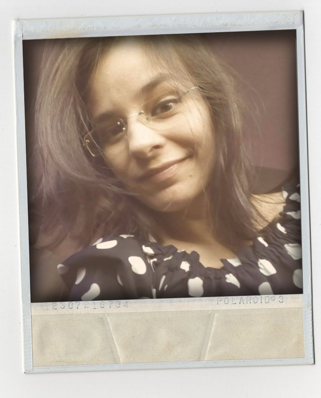

&nbsp;

{: style="float: left" height="32%" width="32%"}

&nbsp;

Ph.D. Student    
[Computer Center - Cin](https://www3.cin.ufpe.br/br/)    
[Federal University of Pernambuco - UFPE](https://www.ufpe.br/)    
{: style="float: left" height="3%" width="3%"} [Currículo Lattes](http://lattes.cnpq.br/4794576859225227/) 

&nbsp;

&nbsp;

I'm currently studying for a doctorate degree in Computer Science at Federal University of Pernambuco (Cin/UFPE), Recife, PE - Brazil. Advised by [Prof. Dr. Marcelo d’Amorim](https://cin.ufpe.br/~damorim/).

*My research interests include Software Engineering, Programming language, Software Development, Image Processing, Big Data, Data Mining, Text Mining, AI, Deep Learning, Data Analysis, Bibliometrics, Electronic Medical Records, Applied Behavior Analysis (ABA), Autism, Biotechnology and Gamification in Education.*

### Project
I am part of the **Visual Sketching** project.
The broad objective of the research is to make it easier for the developer to build quality software. The current research project involves the creation of a system that allows the developer to discover code fragments from images and thus promote the use of code already validated/tested.

* Details on the idea can be found in the position paper ["Visual Sketching"](https://www.cin.ufpe.br/~damorim/publications/damorim-etal-icsenier2020.pdf) (ICSE "New Ideas and Emerging Results" 2020).
* I invite everyone to answer this [**FORM**]( https://forms.gle/hiyCjMmEjFp7pq1v7), which brings some questions whose answers will help me to assess the viability of this project.

### Education
* Ph.D. Computer Science Student at Federal University of Pernambuco (Cin/UFPE), Recife-PE.
* MSc. in Computational Modeling of Knowledgeat at Federal University of Alagoas (IC/UFAL). Maceió-AL.
* MBA in Project Management at Pitagoras College, Maceió-AL.
* Graduation in Systems Analysis and Development at State University of Health Sciences of Alagoas (UNCISAL), Maceió-AL.

### Contact
- [Github](https://github.com/keilabcs/)
- [Linkedin](https://www.linkedin.com/in/keila-barbosa-484ab7192/)
- Skype ID: keila_73
- E-mail: kbcs2@cin.ufpe
- Phone: +55 (82) 99678-9151

